# Used Car Data Analysis Project

Hello, this is my first data analysis project where I want to use skills I have learned like SQL and Tableau but also skills that I want to use for the first time like Python for Data Analysis and R.

The data I chose to use was used car data that I acquired from Kaggle.com. Used car data interested me because the automotive industry is something that piques my interest. I have always liked cars from how they look to watching them being raced on tracks. When I chose to do this project there were two interests, I wanted to combine cars and data analysis.

Why use car data? Many of us come to a point in our life where we want to purchase a vehicle. Most people choose to purchase a pre-owned vehicle than a brand new one. When coming to the decision to buy a pre-owned vehicle there are many factors that you must consider before buying a pre-owned vehicle. To start with first let’s analyze what data we are working with.

## Data

I went to Kaggle.com and found a large dataset that contained entries of Brand, Model, Transmission, Price and more. You can find the dataset here: 
https://www.kaggle.com/datasets/asinow/car-price-dataset (not available anymore)

Here below is a picture detailing each column and their datatype:

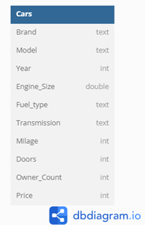

## SQL 

To start creating queries we first need to import our data into a database so that it is stored so that we can pull it and create tables of information with it. So, the tool I used was MySQL.

I imported the data from a .CSV file into the database. Now we are ready to create data queries.
When purchasing a used car, it is always important to compare the difference of price between some used cars based on year, model, brand or transmission type. The following queries provide information about the dataset.

1.	What are the top 5 most expensive cars in the dataset based on price?

To find the most expensive cars in the dataset we first must retrieve the Brand, Model, and Price. When using the AVG function for price we can find the total average price of each model. We then order the Average from highest to lowest and limit to give use the top 5.

Query:

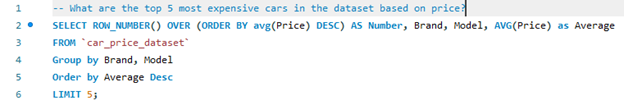

Result:

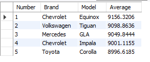
   
From the result we can determine that the top 5 cars that have a good average price are the Chevrolet Equinox, Volkswagen Tigan, Mercedes GLA, Chevrolet Impala, and Toyota Corola.

***
  
2.	What is the average price of a car model grouped by year of manufacture?

To make this query we will need the Brand, Model, count of number of cars, year, and the average price. Every year a different model is manufactured so it is important to get the price based on the year depending on how old you want your car.

Query:

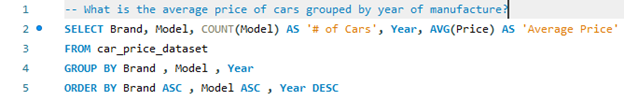

Result:

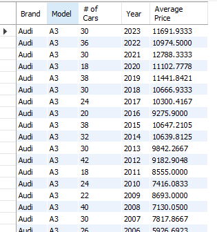

 
From the results above I can determine that based on the Audi A3 we can see that in some years a newer car can have a smaller average price than others. For example, in 2022 the average price is $10974 while the 2021 price is $12788. This means you could get a newer model car for less than a newer model.

***
 
3.	Which year has the highest average price for cars?

When we want to find the average price of cars based on the year of the car, we need to retrieve the Year and the Avg of prices based on the year. 

Query:

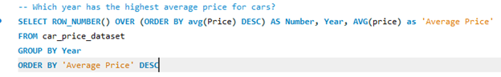

Result:

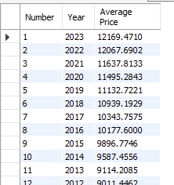

From the result  we can determine that the average price of a car based on the year of the model decreased each year in order from 2023 all the way to 2000. 

***

4.	Which brand has the highest average price for cars with automatic transmission?

The transmission of a vehicle is important in an era where manual transmission are being faded out and automatic transmission is now the standard. A great majority of new drivers choose to purchase automatic transmission vehicles. Now to find the highest average price based on the automatic transmission. We will need the Brand, Transmission, and the average price.

Query:

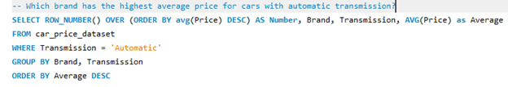

Result:

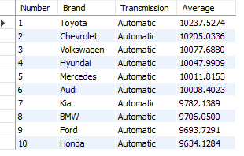

 
From the result table above, we can determine that the brand that has the highest average price of a car with automatic transmission is Toyota with Chevrolet not too far behind in second. Now when we want to see who has the lowest average, we can determine that Honda has the lowest price.

***

5. Which manufacturer has the most cars listed in the dataset?

Some people when looking to purchase a vehicle like to stick to a specific brand that they might like more than others. To find these out we should get the brand and the count of how many models there are.

Query:

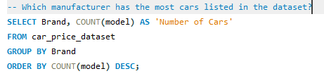

Result:

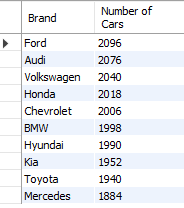
 
From the results we can determine that Ford has the most cars in the dataset and Mercedes has the least number of cars in 1884.

***

6.	Which fuel type (e.g., gasoline, diesel, electric) is most common in the dataset?

Currently gasoline vehicles are slowly fading out as hybrid and electric vehicles rise. So, we should see how many different types of fuel type vehicles are in the dataset. To get the table we should pull the fuel type and the count of how many different types of fuel type cars are in the dataset.

Query:

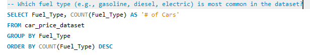

Result:

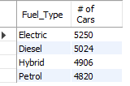

From the results we can determine that in the dataset there are 5250 electric vehicles and 4820 gasoline (petrol) fuel type cars. So, you can tell that electric cars are being slowly rising as the years of the cars in the dataset range from 2000 – 2023.

***

7. Which manufacturer has the highest number of electric vehicles in the dataset?

Now that we know that electric vehicles are the majority of fuel type vehicles in the dataset, we should now find out which manufacturer has the highest number of electric vehicles in the dataset. To get this information we should pull the Brand, the count of fuel type and making sure it only retrieves electric vehicles.

Query:

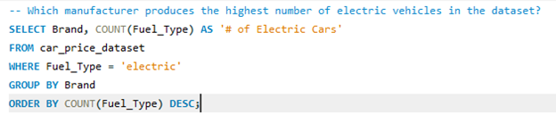

Result:

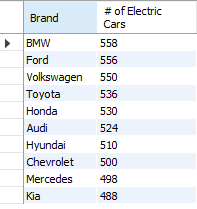
 
From the results table I can determine that BMW has 558 which is the most electric vehicles in the dataset and Kia has the lowest at 488. Although the difference between the highest and lowest is only 70. This means that almost all Brands have a good distribution of electric vehicles in the dataset.

***

8. How have used electric vehicle prices changed over the years?

Now that we have seen the margin of electric cars between brands we should now see the trajectory of electric vehicles over the years. To get this information we can pull the fuel type that is only electric, year, and average price.

Query:

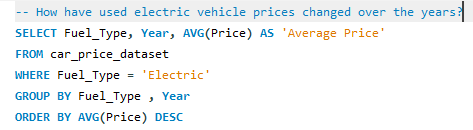

Result:

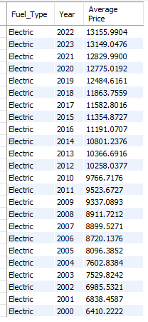
 
From the result table above, I can determine that consistently prices of electric vehicles based on the year go down as the year go down except in some years like 2023 and 2010. In these years the price is higher than the previous.

***

9. What is the distribution of cars based on body type (e.g., sedan, SUV, coupe, hatchback)?

People when looking for a car see that the size of the car is an important factor. To determine the size of the car we can look at the number of car doors on the vehicle. From the dataset I saw that there is no column to determine what type of car it is based on the number of doors. So, I made a case to determine what type of car it is. I retrieved the Brand, car type and the count of how many cars types each car has.

Query:

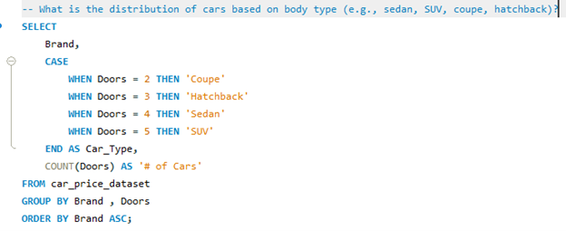

Result:

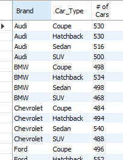

  
From the dataset we can determine what type of brands they have and what type of cars. For example, for Audi we can determine that the majority of their cars are coupes and hatchback. 

***

10.	Which car has the lowest mileage but has had more than two owners?

To determine which car has the lowest mileage and has more than two owners we will need to retrieve the brand, model, year, lowest milage, and the owner count.

Query:

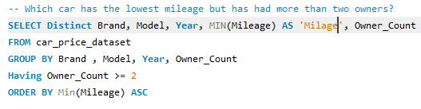

Result:

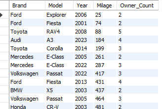
 
In the result table we can determine that in the dataset there is a 2006 Ford Explorer with 25 miles with an owner count of 2. I decided it was important to know the year of the car because the older the model with fewer miles the less it may cost but if you were looking for a car that is newer with fewer miles the more expensive it may be.

## Conclusion

In conclusion, when looking for used cars there are many different factors one can look at to determine if they want to purchase a car. This can range from the number of doors to the transmission type, or even the fuel type of the car. This project was something I wanted to do to use my SQL skills more and evaluate data. I the future I hope to create a project that incorporates more table and more complex questions. Thank you.
